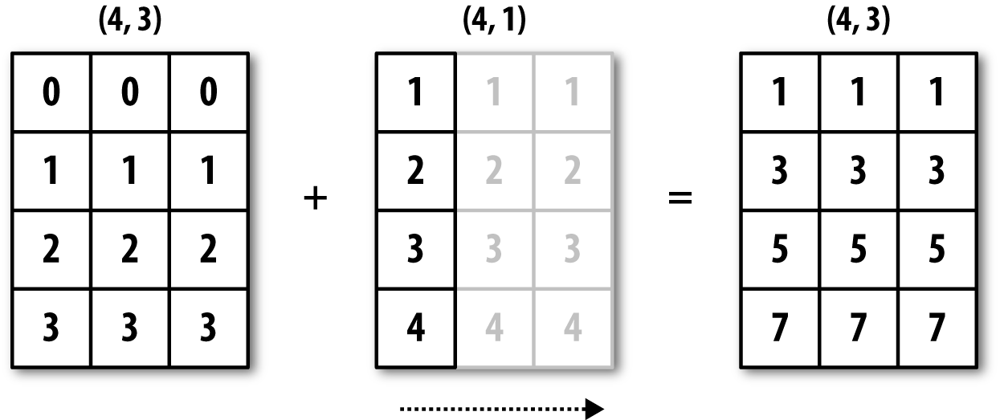
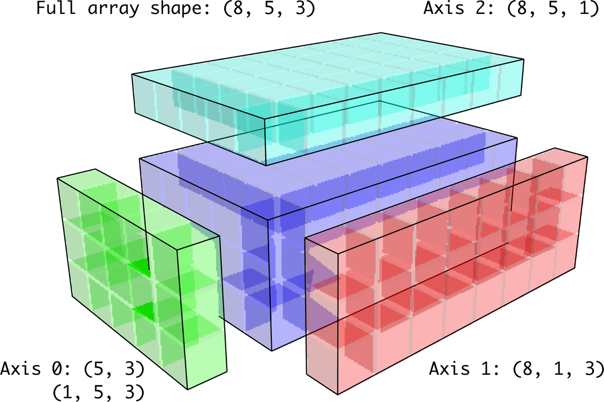
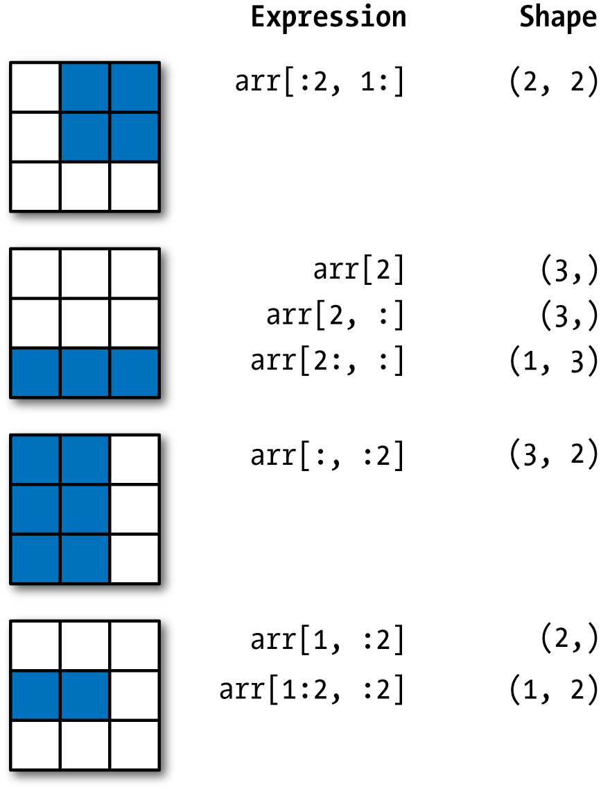

class: content

```{r setup, include=FALSE}
options(htmltools.dir.version = FALSE)
```

<div class="content-page">
  <p class="content-page-title">目录</p>
  <li class="content-page-list">NumPy 简介</li>
  <li class="content-page-list">NumPy 多维数组对象</li>
  <li class="content-page-list">NumPy 面向数据编程</li>
</div>

---
class: inverse, center, middle

# NumPy 简介

---
class:

# NumPy

NumPy 是使用 Python 进行科学计算的基础软件包。它包括：

- 功能强大的 N 维数组对象。
- 精密广播功能函数。
- 集成 C/C+ 和 Fortran 代码的工具。
- 强大的线性代数、傅立叶变换和随机数功能。

NumPy 包的核心是 `ndarray` 对象。它封装了 Python 原生的同数据类型的 N 维数组，为了保证其性能优良，其中有许多操作都是代码在本地进行编译后执行的。

在后续内容中，我们会使用下面的快捷方式导入 NumPy：

```{python}
import numpy as np
```

---
class:

# NumPy

NumPy 数组和原生 Python Array（数组）之间有几个重要的区别：

- NumPy 数组在创建时具有固定的大小，与 Python 的原生数组对象（可以动态增长）不同。更改 `ndarray` 的大小将创建一个新数组并删除原来的数组。
- NumPy 数组中的元素都需要具有相同的数据类型，因此在内存中的大小相同。 例外情况：Python 的原生数组里包含了 NumPy 的对象的时候，这种情况下就允许不同大小元素的数组。
- NumPy 数组有助于对大量数据进行高级数学和其他类型的操作。通常，这些操作的执行效率更高，比使用 Python 原生数组的代码更少。
- 越来越多的基于 Python 的科学和数学软件包使用 NumPy 数组，虽然这些工具通常都支持 Python 的原生数组作为参数，但它们在处理之前会还是会将输入的数组转换为 NumPy 的数组，而且也通常输出为 NumPy 数组。

---
class:

# NumPy

NumPy 的高效得益于**向量化**和**广播**：

向量化描述了代码中没有任何显式的循环，索引等。这些当然是预编译的 C 代码中“幕后”优化的结果。向量化代码有许多优点，其中包括：

- 向量化代码更简洁，更易于阅读
- 更少的代码行通常意味着更少的错误
- 代码更接近于标准的数学符号（通常，更容易正确编码数学结构）
- 向量化导致产生更多 “Pythonic” 代码。如果没有向量化，我们的代码就会被低效且难以阅读的 `for` 循环所困扰。

广播是用于描述操作的隐式逐元素行为的术语。 一般来说，在 NumPy 中，所有操作，不仅仅是算术运算，逻辑，位，功能等，都以这种隐式的逐元素方式进行广播。有关广播的详细“规则”，请参阅 `numpy.doc.broadcasting`。

---
class: inverse, center, middle

# NumPy 多维数组对象

---
class:

# NumPy 数据类型

NumPy 支持比 Python 更多种类的数据类型，NumPy 的数值类型实际上是 `dtype` 对象的实例，并对应唯一的字符。

| NumPy 类型                          | 类型代码     | 描述                                                         |
| ----------------------------------- | ------------ | ------------------------------------------------------------ |
| `int8, uint8`                       | `i1, u1`     | 有符号和无符号的 8 位整数                                    |
| `int16, uint16`                     | `i2, u2`     | 有符号和无符号的 16 位整数                                   |
| `int32, uint32`                     | `i4, u4`     | 有符号和无符号的 32 位整数                                   |
| `int64, uint64`                     | `i8, u8`     | 有符号和无符号的 64 位整数                                   |
| `float16`                           | `f2`         | 半精度浮点数                                                 |
| `float32`                           | `f4` 或 `f`  | 标准单精度浮点数，兼容 C 语言 `float`                        |
| `float64`                           | `f8` 或 `d`  | 标准双精度浮点数，兼容 C 语言 `double` 和 Python `float`     |
| `float128`                          | `f16` 或 `g` | 拓展精度浮点数                                               |

---
class:

# NumPy 数据类型

| NumPy 类型                                | 类型代码     | 描述                                                         |
| ----------------------------------------- | ------------ | ------------------------------------------------------------ |
| `complex64, complex128,`<br/>`complex256` |              |                                                              |
| `bool`                                    | `?`          | 布尔值，`True` 或 `False`                                    |
| `object`                                  | `O`          | Python `object` 类型                                         |
| `string_`                                 | `S`          | 修正的 ASCII 字符串类型，长度为 10 的字符串类型，使用 `S10`。|
| `unicode_`                                | `U`          | 修正的 Unicode 类型，长度为 10 的 Unicode 类型，使用 `U10`。 |

---
class:

# NumPy 创建数组

.pull-left[
生成数组最简单的方式就是使用 `array` 函数。`array` 函数接收任意的序列类型对象（也包括其他的数组），生成一个新的包含传递数据的 NumPy 数组。

```{python}
d1 = [1, 2.0, 3]
a1 = np.array(d1)
a1
```

嵌套序列会自动转换成多维数组：

```{python}
d2 = [[1, 2, 3], [4, 5, 6]]
a2 = np.array(d2)
a2
```
]

.pull-right[
可以通过 `ndim` 和 `shape` 属性确定数组的维度和形状：

.pull-left[
```{python}
a2.ndim
```
]

.pull-right[
```{python}
a2.shape
```
]

.clear[
除非显式的指定，否则 `np.array` 会自动推断数组的数据类型。数据类型存储在一个特殊的元数据 `dtype` 中：

.pull-left[
```{python}
a1.dtype
```
]

.pull-right[
```{python}
a1.dtype
```
]
]
]

---
class:

# NumPy 创建数组

NumPy 还可以通过其他函数生成数组，如下表所示：

| 函数名              | 描述                                                         |
| ------------------- | ------------------------------------------------------------ |
| `array`             | 将输入数据转换为 `ndarray`，如不显式指明数据类型，则自动推断，复制所有输入数据 |
| `asarray`           | 将输入转换为 `ndarray`，但如果输入已经是 `ndarray` 则不在复制 |
| `arange`            | Python 内建函数 `range` 的数组版，返回一个数组               |
| `ones, ones_like`   | 根据给定形状和数据类型生成全 1 数组，根据给定数组生成形状一样的全 1 数组 |
| `zeros, zeros_like` | 根据给定形状和数据类型生成全 0 数组，根据给定数组生成形状一样的全 0 数组 |
| `empty, empty_like` | 根据给定形状和数据类型生成空数组，根据给定数组生成形状一样的空数组 |
| `full, full_like`   | 根据给定形状和数据类型生成指定数值的数组，根据给定数组生成形状一样的指定数值的数组 |
| `eye, indentity`    | 生成一个 $N \times N$ 的特征矩阵（对角线值为 1，其余为 0）   |

---
class:

# NumPy 数组算术

.pull-left[
NumPy 允许批量运算而无需任何 `for` 循环，该特性称之为**向量化**，任何两个等尺寸数组之间的算数操作搜是逐元素的：

```{python}
arr = np.array([[1., 2., 3.], [4., 5., 6.]])
arr * arr
arr - arr
```
]

.pull-right[
标量计算的算术操作会把参数传递给数组的每个元素：

```{python}
1 / arr
arr ** 0.5
```

同尺寸数组之间的比较会产生一个布尔值数组 。
]

---
class:

# NumPy 广播

广播描述了算法如何在不同形状的数组之间进行运算，它功能强大，但也可能会导致混淆。

.blockcode-note[
**广播的原则**：如果对于每个结尾维度（即从尾部开始的），轴长度都匹配或者长度都是 1， 两个数组就是可以兼容广播的。之后，广播会在丢失的或长度为 1 的轴上进行。
]

.pull-left[
```{python}
arr = np.random.randn(4, 3)
arr.mean(0)
arr - arr.mean(0)
```
]

.pull-right[
<br/>


]

---
class:

# NumPy 广播

假如我们希望减去每一行的平均值，由于 `arr.mean(0)` 的长度为 3，因此他与轴 0 上的广播兼容，因为 `arr` 中的结尾维度为 3，因此匹配。为了从轴 1 减去均值（即从每行减去行平均值），较小的数组的形状必须是 `(4, 1)`。

.pull-left[
```{python}
arr = np.random.randn(4, 3)
arr - arr.mean(1).reshape((4, 1))
```
]

.pull-right[

]

---
class:

# NumPy 广播

下图为对沿着轴将一个二维数组加到三维数组的示意：

.center[
```{r, echo=F, out.width="60%"}
knitr::include_graphics('images/broadcasting-over-axis-0-of-a-3d-array.png')
```
]

---
class:

# NumPy 广播

根据广播规则，“广播维度”在较小的数组中须为 1，在“行减均值”的例子中，意味着形状需要是 `(4, 1)` 而不是 `(4, )`。使用 `reshape` 是一种选择，但插入一个轴需要构造一个表示新形状的元组。在三维情况下，任何一个维度上进行广播只是将数据塑造为形状兼容的问题，下图显示了三维数组的每个轴上广播所需的形状：

.center[
```{r, echo=F, out.width="50%"}

```
]

---
class:

# NumPy 索引

.pull-left[
NumPy 的 `ndarray` 数据可以通过索引和切片进行访问和修改，与 Python 的内建列表类似。

```{python}
arr = np.arange(6)
arr
arr[3]
arr[4:6]
```
]

.pull-right[
```{python}
arr[0:2] = 9
arr
```

当传入一个数值给数组的切片后，数值被传递给了整个切片，这区别于 Python 的内建列表，数组的切片是原数据的视图，这意味着数据并不是被复制了，任何对于视图的修改都会反映到原数组上。

```{python}
arr_slice = arr[0:2]
arr_slice[:] = 0
arr
```
]

---
class:

# NumPy 索引

.pull-left[
对于一个二维数组，每个索引值对应的元素不再是一个值，而是一个一维数组。

```{python}
arr = np.array([[1, 2, 3], [4, 5, 6], [7, 8, 9]])
arr[2]
```

通过递归方式或传递索引的逗号分割列表获取元素：

```{python}
arr[0][2]
arr[0, 2]
```
]

.pull-right[
.center[
```{r, echo=F, out.width="60%"}
knitr::include_graphics('images/indexing-elements-in-a-numpy-array.png')
```
]

在二维数组上索引，我们可以将 0 轴看做“行”，将 1 轴看做“列”。
]

---
class:

# NumPy 索引

.pull-left[
在多维数组中，可以省略后续索引值，返回的对象是降低一个维度的数组。

```{python}
arr = np.array([[[1, 2, 3], [4, 5, 6]],
                [[7, 8, 9], [10, 11, 12]]])
arr
```
]

.pull-right[
```{python}
arr[0]
```

类似地，`arr[1, 0]` 返回的是一个一维数组：

```{python}
arr[1, 0]
```

需要注意的是，以上数组的子集中返回的都是视图。
]

---
class:

# NumPy 切片

.pull-left[
与 Python 列表的一维对象类似，数组可以通过类似的语法进行切片：

```{python}
arr = np.array([1, 2, 3, 4, 5, 6])
arr
arr[1:3]
```

对于二维数组进行切片略有不同：
]

.pull-right[
```{python}
arr = np.array([[1, 2, 3], [4, 5, 6], [7, 8, 9]])
arr[:2]
```

数组沿着轴 0 进行切片，表达式 `arr[:2]` 表示选择 `arr` 的前两**“行”**。也可以进行多阻切片：

```{python}
arr[:2, 1:]
```
]

---
class:

# NumPy 切片

.pull-left[
需要注意的是，单独的一个冒号表示选择整个轴上的数组，因此可以按照如下方式在更高维度上进行切片：

```{python}
arr[:, :1]
```

对整个切片表达式赋值，整个切片都会重新赋值：

```{python}
arr[:2, 1:] = 0
arr
```
]

.pull-right[.center[
```{r, echo=F, out.width="70%"}

```
]]

---
class:

# NumPy 布尔索引

.pull-left[
考虑如下例子，每个人名和 `data` 数组中的一行对应：

```{python}
names = np.array(
    ['Bob', 'Joe', 'Leo', 'Tom', 'Leo'])
data = np.random.randn(5, 3)
names
data
```
]

.pull-right[
我们想要选中所有 `Leo` 对应的行，数组的比较操作也是可以向量化的：

```{python}
names == 'Leo'
```

在索引数据时可以传入布尔值数组：

```{python}
data[names == 'Leo']
```

布尔数组的长度必须和数组轴索引长度一致，不一致时并不会报错，因此建议使用该特性时要注意。
]

---
class:

# NumPy 布尔索引

.pull-left[
```{python}
data[names != 'Leo']
data[~(names == 'Leo')]
```
]

.pull-right[
```{python}
data[(names == 'Leo') | (names == 'Bob')]
data[names == 'Leo', 1:]
```
]

---
class:

# NumPy 数组转置和换轴

.pull-left[
转置是一种特殊的数据重组形式，可以返回数据的视图而不需要复制任何内容。数组拥有 `transpose` 方法，也有特殊的 `T` 属性：

```{python}
arr = np.arange(12).reshape((3, 4))
arr.T
```

对于更高维度的数组，`transpose` 方法可以接受包含轴编号的元素，用于置换轴：

```{python}
arr = np.arange(16).reshape((2, 2, 4))
```
]

.pull-right[
```{python}
arr
arr.transpose((1, 0, 2))
```
]

---
class:

# NumPy 数组转置和换轴

使用 `.T` 进行转置是换轴的一个特殊案例。`ndarray` 有一个 `swapaxes` 方法，该方法接收一堆轴编号作为参数，并对轴进行调整用于重组数据：

.pull-left[
```{python}
arr
```
]
.pull-right[
```{python}
arr.swapaxes(1, 2)
```
]

---
class:

# NumPy 通用函数

通用函数，也可以称为 `ufunc`，是一种在 `ndarray` 数据中进行逐元素操作的函数。某些简单函数接收一个或多个标量数值，并产生一个或多个标量结果，而通用函数就是对这些简单函数的向量化封装。

```{python}
arr = np.arange(10)
arr
np.sqrt(arr)
```

这些是所谓的一元通用函数，还有一些通用函数，例如 `add` 或 `maximum` 则会接受两个数组并返回一个数组作为结果，因此称之为二元通用函数。

---
class:

# NumPy 一元通用函数

| 函数名                    | 描述                                                         |
| ------------------------- | ------------------------------------------------------------ |
| `abs, fabs`               | 逐元素地计算整数、浮点数或复数的绝对值                       |
| `sqrt`                    | 计算每个元素的平方根（与 `arr ** 0.5` 相等）                 |
| `square`                  | 计算每个元素的平方（与 `arr ** 2` 相等）                     |
| `exp`                     | 计算每个元素的自然指数值 $e^x$                               |
| `log, log10, log2, log1p` | 自然对数（ $e$ 为底），对数 10 为底，对数 2 为底， $log \left(1+x\right)$ |
| `sign`                    | 计算每个元素的符号值：1 为正数，0 为 0，-1 为负数            |
| `ceil`                    | 计算每个元素的最高整数值，即向上取整                         |
| `floor`                   | 计算每个元素的最小整数值，即向下取整                         |

.center[(接下表)]

---
class:

# NumPy 一元通用函数

.center[(接上表)]

| 函数名                                                   | 描述                                               |
| -------------------------------------------------------- | -------------------------------------------------- |
| `rint`                                                   | 将元素保留至整数位，并保持 `dtype`                 |
| `modf`                                                   | 分别将数组的小数部分和整数部分按数组形式返回       |
| `isnan`                                                  | 返回数组中的元素是否是一个 `NaN`，返回布尔型数组   |
| `isfinite, isinf`                                        | 返回数组中的元素是否有限，是否无限，返回布尔型数组 |
| `cos, cosh, sin, sinh, tan, tanh`                        | 常规三角函数                                       |
| `arccos, arccosh, arcsin`<br/>`arcsinh, arctan, arctanh` | 常规反三角函数                                     |
| `logical_not`                                            | 对数组的元素按位取反（与 `~arr` 相等）             |

---
class:

# NumPy 二元通用函数

| 函数名                 | 描述                                         |
| ---------------------- | -------------------------------------------- |
| `add`                  | 将数组的对应元素相加                         |
| `substract`            | 将第一个数组逐元素减去第二个数组中的对应元素 |
| `multiply`             | 将数组逐元素相乘                             |
| `divide, floor_divide` | 除或乘除                                     |
| `power`                | 将第二个数组的元素作为第一个数组对应元素     |
| `maximum, fmax`        | 逐个元素计算最大值，`fmax` 忽略 `NaN`        |
| `miximum, fmin`        | 逐个元素计算最小值，`fmin` 忽略 `NaN`        |

.center[(接下表)]

---
class:

# NumPy 二元通用函数

.center[(接上表)]

| 函数名                                                       | 描述                                       |
| ------------------------------------------------------------ | ------------------------------------------ |
| `mod`                                                        | 按元素的取模计算                           |
| `copysign`                                                   | 将第一个数组的符号值改为第二个数组的符号值 |
| `greater, greater_equal`<br/>`less, less_equal`<br/>`equal, not_equal` | 同操作符 `>, >=, <, <=, ==, !=`            |
| `logical_and`<br/>`logical_or`<br/>`logical_xor`             | 同操作符 `&, 丨, ^`                        |

---
class: inverse, center, middle

# NumPy 面向数组编程

---
class:

# NumPy 面向数组编程

使用 NumPy 数组可以使你利用简单的数组表达式完成多种数组操作任务，而无须写大量循环。这种利用数组表达式来替代显示循环的方法，成为向量化。通常，向量化的数组操作回避纯 Python 的等价实现在速度上快一到两个数量级（甚至更多），这对所有种类的数值计算产生了很大的影响。

`np.where` 函数是三元表达式 `x if condition else y` 的向量化版本，假设有如下数组：

```{python}
xarr = np.array([1.1, 1.2, 1.3, 1.4, 1.5])
yarr = np.array([2.1, 2.2, 2.3, 2.4, 2.5])
cond = np.array([True, False, True, True, False])
```


.pull-left[
假设 `cond` 中的元素为 `True` 时，我们取 `xarr` 中的元素，否则取 `yarr` 中的元素，列式推导代码如下：

```{python}
[(x if c else y) for x, y, c in zip(xarr,yarr,cond)]
```
]

.pull-right[
当数组很大时，这种操作会很慢，同时当数组为多维时，就无法奏效了，`np.where` 代码如下：

```{python}
np.where(cond, xarr, yarr)
```
]

---
class:

# NumPy 数学和统计方法

许多关于计算整个数组统计值或关于轴向数据的数学函数，可以作为数组类型的方法被调用。你可以使用聚合函数，比如 `sum, mean` 和 `std`，既可以使用数组实例的方法，也可以使用顶层的 NumPy 函数。

.pull-left[
```{python}
arr = np.random.randn(4, 3)
arr
arr.mean()
```
]

.pull-right[
```{python}
np.mean(arr)
arr.mean(axis=1)
arr.sum(axis=0)
```
]

---
class:

# NumPy 统计方法

基础数组统计方法如下表所示：

| 函数名           | 描述                                 |
| ---------------- | ------------------------------------ |
| `sum`            | 沿着轴向计算所有元素的累加           |
| `mean`           | 沿着轴向计算数学平均                 |
| `std, var`       | 标准差和方差，可以选择自由度挑战俄国 |
| `min, max`       | 最小值和最大值                       |
| `argmin, argmax` | 最小值和最大值的位置                 |
| `cumsum`         | 从 0 开始元素累积和                  |
| `cumprod`        | 从 1 开始元素累积积                  |

---
class:

# NumPy 排序

.pull-left[
和 Python 内建列表类型相似，NumPy 数组可以使用 `sort` 方法按位置排序：

```{python}
arr = np.random.randn(3)
arr
arr.sort()
arr
```

在多维数组中根据传的的 `axis` 值，沿着轴向对每个一维数据段进行排序：
]

.pull-right[
```{python}
arr = np.random.randn(3, 3)
arr
arr.sort(1)
arr
```

顶层的 `np.sort` 方法返回的是已经排序好的数组拷贝，而不是对原数组按位置排序。
]

---
class:

# NumPy 集合操作

NumPy 包含一些针对一维 `ndarray` 的基础集合操作，常用集合操作如下表所示：

| 函数名            | 描述                                                   |
| ----------------- | ------------------------------------------------------ |
| `unique(x)`       | 计算 `x` 的唯一值，并排序                              |
| `intersect1d(x)`  | 计算 `x` 和 `y` 的交集，并排序                         |
| `union1d(x)`      | 计算 `x` 和 `y` 的并集，并排序                         |
| `in1d(x)`         | 计算 `x` 中的元素是否包含在 `y` 中，返回一个布尔值数组 |
| `setdiff1d(x, y)` | 差集，在 `x` 中但不在 `y` 中的 `x` 的元素              |
| `setxor1d(x, y)`  | 异或集，在 `x` 或 `y` 中，但不属于 `x, y` 交集的元素   |

---
class:

# NumPy 线性代数

线性代数，例如矩阵乘法、分解、行列式等矩阵运算是所有数组类库的重要组成部分，常用线性代数函数如下表所示：

| 函数名  | 描述                                                         |
| ------- | ------------------------------------------------------------ |
| `diag`  | 将一个方阵的对角元素作为一维数组返回，或将一维数组转换<br/>成一个方阵，并将非对角线上的元素置为零 |
| `dot`   | 矩阵点乘                                                     |
| `trace` | 计算对角元素和                                               |
| `det`   | 计算矩阵的行列式                                             |
| `eig`   | 计算方阵的特征值和特征向量                                   |

.center[(接下表)]

---
class:

# NumPy 线性代数

.center[(接上表)]

| 函数名  | 描述                                         |
| ------- | -------------------------------------------- |
| `inv`   | 计算方阵的逆矩阵                             |
| `pinv`  | 计算矩阵的 Moore-Penrose 伪逆                |
| `qr`    | 计算 QR 分解                                 |
| `svd`   | 计算奇异值分解                               |
| `solve` | 求解 $x$ 的线性系统 $Ax=b$ ，其中 $A$ 是方阵 |
| `lstsq` | 计算 $Ax=b$ 的最小二乘解                     |

---
class:

# NumPy 伪随机数生成

`np.random` 模块填补了 Python 内建的 `random` 的不足，可以高效的生成多种概率分布下的数组，部分函数如下：

.pull-left[
| 函数名        | 描述                                                   |
| ------------- | ------------------------------------------------------ |
| `seed`        | 向随时数生成器传递随机数种子                           |
| `permutation` | 返回一个序例的随机排列，或者返回一个乱序的整数范围序列 |
| `shuffle`     | 随机排序一个序列                                       |
| `rand`        | 从均匀分布中抽取样本                                   |
| `randint`     | 根据给定的由低到高范围抽取随机整数                     |
| `randn`       | 从均值 0 方差 1 的正态分布中抽样样本（MATLAB 型接口）  |
]

<br/>

| 函数名      | 描述                                      |
| ----------- | ----------------------------------------- |
| `binomial`  | 从二项分布中抽取样本                      |
| `normal`    | 从正态分布中抽取样本                      |
| `beta`      | 从 beta 分布中抽取样本                    |
| `chisquare` | 从卡方分布中抽取样本                      |
| `gamma`     | 从伽马分布中抽取样本                      |
| `uniform`   | 从均匀分布 $\left[0, 1\right)$ 中抽取样本 |

---
class: thanks, center, middle

# Thanks


本作品采用 [**CC BY-NC-SA 4.0**](https://creativecommons.org/licenses/by-nc-sa/4.0/) 进行许可

Copyright © [**小黑 | Mr. Black**](https://leovan.me), All Rights Reserved.
