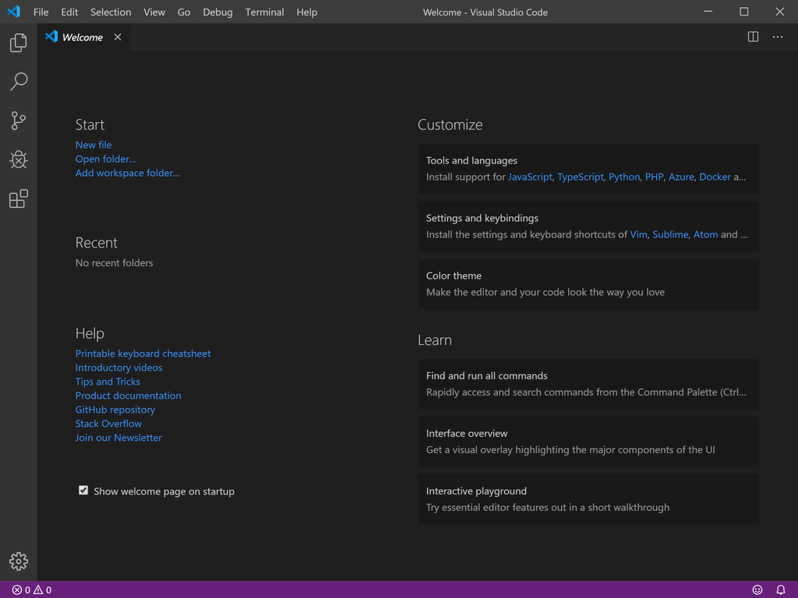
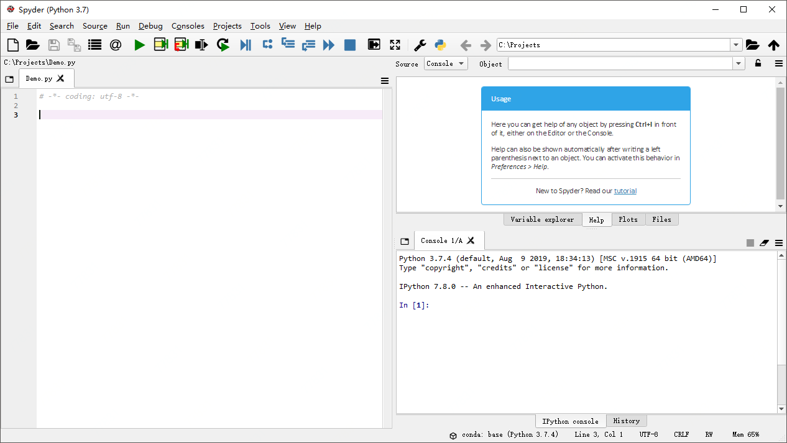
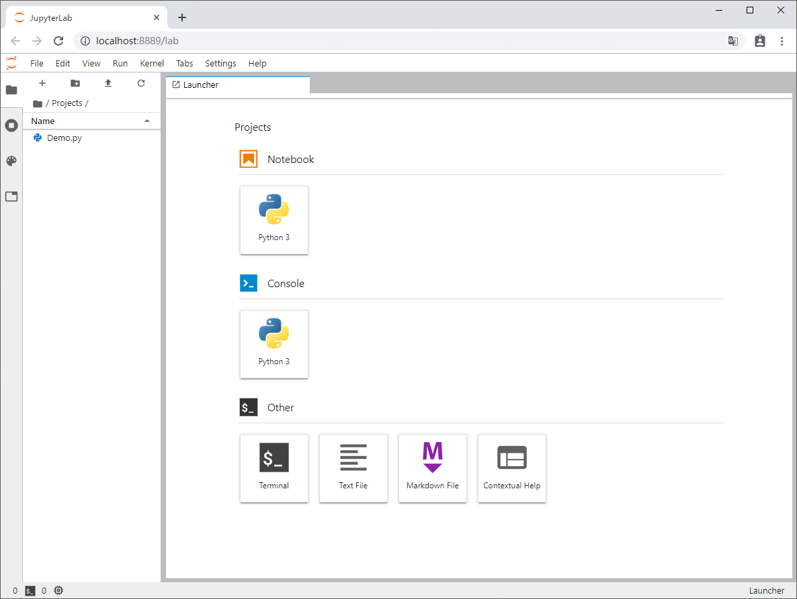

# 集成开发环境配置手册

## 系统要求

1. 本手册适用于 Windows 10+ 系统。
2. 在有足够空间的磁盘建立一个不含空格的目录，用于安装相关环境，例如：`C:\SDK`。
3. 建议安装最新版本 [Typora](http://typora.io)，文档多为 Markdown 格式，Typora 便于浏览和编辑相关文档。

## Visual Studio Code 安装和配置

1. 获取最新版本的 [Visual Studio Code](https://code.visualstudio.com/)。
2. 设置安装路径：
    
3. 选择安装任务：
    
4. Visual Studio Code 启动界面：
    

## Git 安装和配置

1. 获取最新版本的 [Git](https://git-scm.com/)。
2. 设置安装路径：
    
3. 选择安装组件：
    
4. 选择默认编辑器：
    
5. Git 相关操作详见 Pro Git，[在线版本](https://git-scm.com/book/zh/v2)。

## Python 安装和配置

1. 下载最新版本 [Anaconda 3](https://www.anaconda.com/download/)。
2. 选择安装类型：
    
3. 设置安装路径：
    
4. 设置安装选项：
    
5. 启动 Anaconda 3 Navigator：
    

## Spyder 安装和配置

1. Spyder 已经在包含在 Anaconda 3 发行版中。
2. 通过 Anaconda 3 Navigator 或单独启动 Spyder：
    

## Jupyter Lab 安装和配置

1. Jupyter Lab 已经在包含在 Anaconda 3 发行版中。
2. 通过 Anaconda 3 Navigator 启动 Jupyter Lab：
    

## Jupyter Notebook 安装和配置

1. Jupyter Notebook 已经在包含在 Anaconda 3 发行版中。
2. 通过 Anaconda 3 Navigator 启动 Jupyter Notebook：
    
