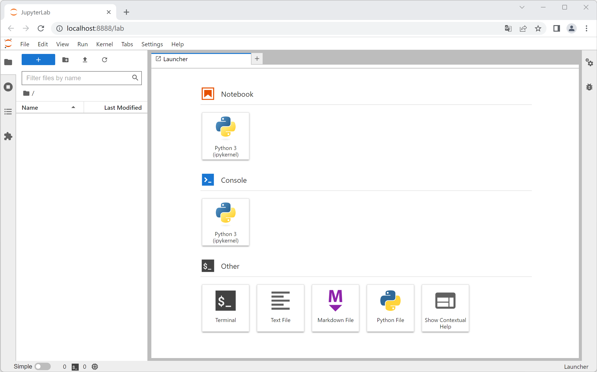
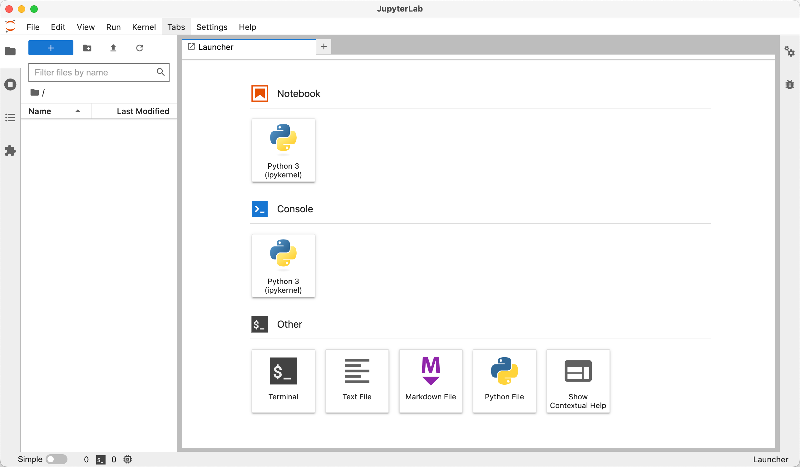

# 开发环境安装配置手册

## Windows

> 建议使用 64 位 Windows 10 以上版本系统。

### 命令行

建议安装最新版的 PowerShell 作为命令行环境，相关下载和配置详见[官网](https://learn.microsoft.com/zh-cn/powershell/)。

打开 PowerShell 命令行，输入如下命令安装 scoop：

```powershell
Set-ExecutionPolicy RemoteSigned -Scope CurrentUser
irm get.scoop.sh | iex
```

[scoop](https://scoop.sh/) 是一个用于 Windows 的命令行包安装管理器，其可以方便用户在命令行中安装并管理应用和扩展包。

运行如下命令测试 scoop 是否成功安装：

```powershell
scoop --version
```

如果能得到类似如下输出，则说明安装成功：

```
Current Scoop version:
v0.3.1 - Released at 2022-11-15
```

运行如下命令为 scoop 添加额外的应用清单：

```powershell
scoop bucket add extras
```

### Git

输入如下命令安装 [Git](https://git-scm.com/)：

```powershell
scoop install git
```

运行如下命令测试 Git 是否成功安装：

```powershell
git --version
```

如果能得到类似如下输出，则说明安装成功：

```
git version 2.39.0.windows.2
```

### Python

输入如下命令安装 [Python](https://www.python.org/)：

```powershell
scoop install python
```

运行如下命令测试 Python 是否成功安装：

```powershell
python --version
```

如果能得到类似如下输出，则说明安装成功：

```
Python 3.11.1
```

### Jupyter

输入如下命令安装 [JupyterLab](https://jupyter.org/)：

```bash
pip install jupyterlab
```

运行如下命令启动 JupyterLab：

```bash
jupyter-lab
```

系统会自动打开浏览器并显示 JupyterLab 页面：



## macOS

> 建议使用 macOS 11 以上版本系统。

### 命令行

打开终端，输入如下命令安装 homebrew：

```bash
/bin/bash -c "$(curl -fsSL https://raw.githubusercontent.com/Homebrew/install/HEAD/install.sh)"
```

[Homebrew](https://brew.sh/) 是一个用于 macOS 的命令行包安装管理器，其可以方便用户在命令行中安装并管理应用和扩展包。

运行如下命令测试 scoop 是否成功安装：

```bash
brew --version
```

如果能得到类似如下输出，则说明安装成功：

```
Homebrew 3.6.19
```

### Git

输入如下命令安装 [Git](https://git-scm.com/)：

```bash
brew install git
```

运行如下命令测试 Git 是否成功安装：

```bash
git --version
```

如果能得到类似如下输出，则说明安装成功：

```
git version 2.39.1
```

### Python

输入如下命令安装 [Python](https://www.python.org/)：

```bash
brew install python
```

运行如下命令测试 Python 是否成功安装：

```bash
python --version
```

如果能得到类似如下输出，则说明安装成功：

```
Python 3.10.9
```

### Jupyter

输入如下命令安装 [JupyterLab](https://jupyter.org/)：

```bash
pip install jupyterlab
```

运行如下命令启动 JupyterLab：

```bash
jupyter-lab
```

系统会自动打开浏览器并显示 JupyterLab 页面：


